<!-- README.md is generated from README.Rmd. Please edit that file -->
ggmap
=====

**ggmap** makes it easy to retrieve raster map tiles from popular online mapping services like [Google Maps](https://developers.google.com/maps/documentation/static-maps/?hl=en), [OpenStreetMap](https://www.openstreetmap.org), [Stamen Maps](http://maps.stamen.com), and plot them using the **ggplot2** framework:

``` r
library(ggmap)

us <- c(left = -125, bottom = 25.75, right = -67, top = 49)
map <- get_stamenmap(us, zoom = 5, maptype = "toner-lite")
ggmap(map)
```

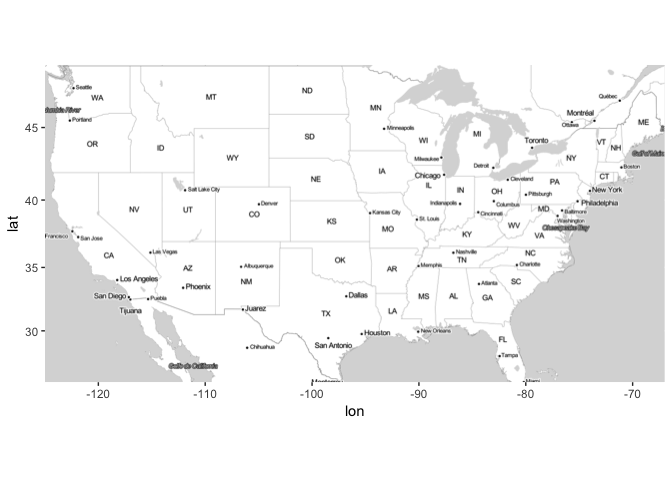

``` r
ggmap(map, extent = "device")
```

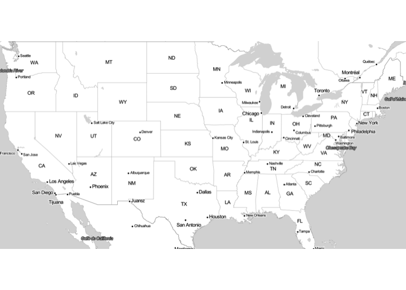

Use `qmplot()` in the same way you'd use `qplot()`, but with a map automatically added in the background:

``` r
library(dplyr)

# only violent crimes
violent_crimes <- filter(crime, 
  offense != "auto theft", offense != "theft", offense != "burglary"
)

# rank violent crimes
violent_crimes$offense <- factor(
  violent_crimes$offense,
  levels = c("robbery", "aggravated assault", "rape", "murder")
)

# restrict to downtown
violent_crimes <- filter(violent_crimes,
  -95.39681 <= lon & lon <= -95.34188,
   29.73631 <= lat & lat <=  29.78400
)

qmplot(lon, lat, data = violent_crimes, maptype = "toner-lite", color = I("red"))
```

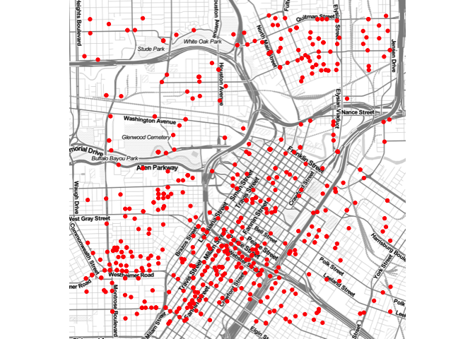

``` r
qmplot(lon, lat, data = violent_crimes, maptype = "toner-lite", geom = "density2d", color = I("red"))
```


Since **ggmap**'s built on top of **ggplot2**, all your usual **ggplot2** stuff (geoms, polishing, etc.) will work, and there are some unique graphing perks **ggmap** brings to the table, too.

``` r
robberies <- violent_crimes %>% filter(offense == "robbery")

qmplot(lon, lat, data = violent_crimes, geom = "blank", zoom = 15, maptype = "toner-background", darken = .7, legend = "topleft") +
  stat_density_2d(aes(fill = ..level..), geom = "polygon", alpha = .3, color = NA) +
  scale_fill_gradient2("Robbery\nPropensity", low = "white", mid = "yellow", high = "red", midpoint = 650)
```

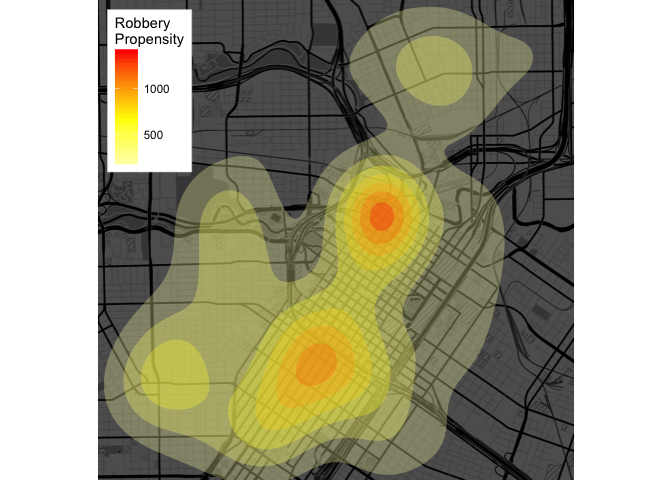

Faceting works, too:

``` r
qmplot(lon, lat, data = violent_crimes, maptype = "toner-background", color = offense) + 
  facet_wrap(~ offense)
```

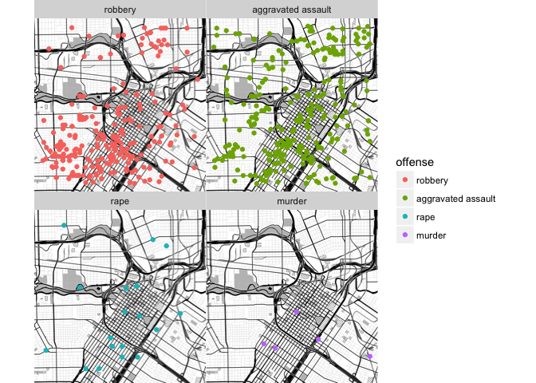

For convenience, here's a map of Europe:

``` r
europe <- c(left = -12, bottom = 35, right = 30, top = 63)
get_stamenmap(europe, zoom = 5) %>% ggmap()
```

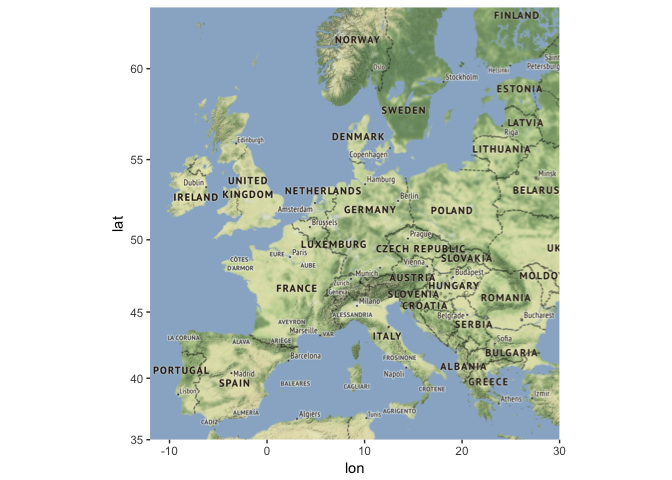

``` r
get_stamenmap(europe, zoom = 5, maptype = "toner-lite") %>% ggmap()
```

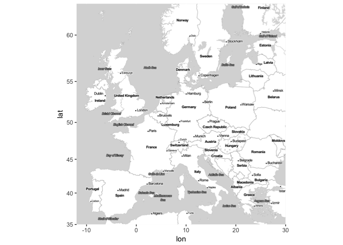

Google Maps and Credentials
---------------------------

[Google Maps](http://developers.google.com/maps/terms) can be used just as easily. However, since Google Maps use a center/zoom specification, their input is a bit different:

``` r
get_googlemap("waco texas", zoom = 12) %>% ggmap()
#  Source : https://maps.googleapis.com/maps/api/staticmap?center=waco+texas&zoom=12&size=640x640&scale=2&maptype=terrain
#  Source : https://maps.googleapis.com/maps/api/geocode/json?address=waco%20texas
```

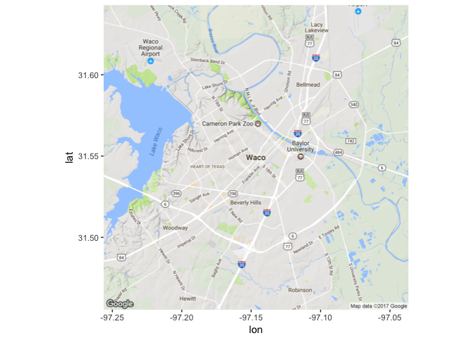

Moreover, you can get various different styles of Google Maps with **ggmap** (just like Stamen Maps):

``` r
get_googlemap("waco texas", zoom = 12, maptype = "satellite") %>% ggmap()
#  Source : https://maps.googleapis.com/maps/api/staticmap?center=waco+texas&zoom=12&size=640x640&scale=2&maptype=satellite
#  Source : https://maps.googleapis.com/maps/api/geocode/json?address=waco%20texas
```

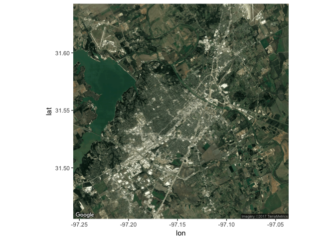

``` r
get_googlemap("waco texas", zoom = 12, maptype = "roadmap") %>% ggmap()
#  Source : https://maps.googleapis.com/maps/api/staticmap?center=waco+texas&zoom=12&size=640x640&scale=2&maptype=roadmap
#  Source : https://maps.googleapis.com/maps/api/geocode/json?address=waco%20texas
```

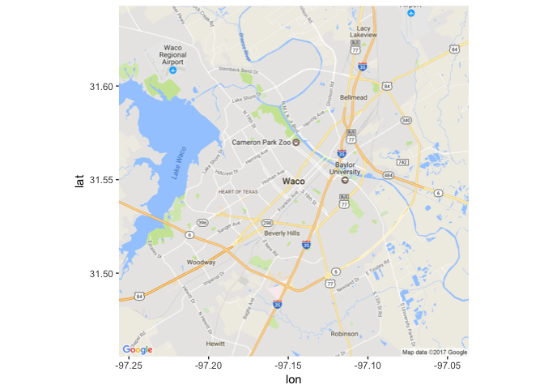

``` r
get_googlemap("waco texas", zoom = 12, maptype = "hybrid") %>% ggmap()
#  Source : https://maps.googleapis.com/maps/api/staticmap?center=waco+texas&zoom=12&size=640x640&scale=2&maptype=hybrid
#  Source : https://maps.googleapis.com/maps/api/geocode/json?address=waco%20texas
```

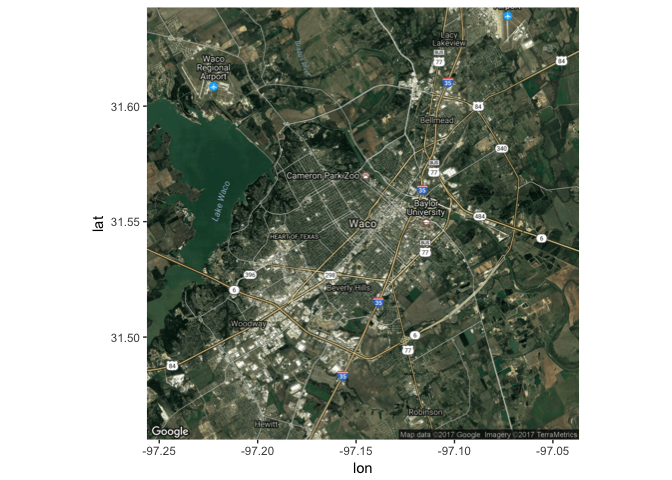

Google's geocoding and reverse geocoding API's are available through `geocode()` and `revgeocode()`, respectively:

``` r
geocode("1301 S University Parks Dr, Waco, TX 76798")
#  Source : https://maps.googleapis.com/maps/api/geocode/json?address=1301%20S%20University%20Parks%20Dr%2C%20Waco%2C%20TX%2076798
#         lon      lat
#  1 -97.1161 31.55098
revgeocode(c(lon = -97.1161, lat = 31.55098))
#  Information from URL : https://maps.googleapis.com/maps/api/geocode/json?latlng=31.55098,-97.1161
#  [1] "1301 S University Parks Dr, Waco, TX 76706, USA"
```

There is also a `mutate_geocode()` that works similarly to [**dplyr**](https://github.com/hadley/dplyr)'s `mutate()` function:

``` r
library(tidyverse)
tb <- data_frame(address = c("1600 Pennsylvania Avenue, Washington DC", "", "waco texas"))
tb %>% mutate_geocode(address)
#  Source : https://maps.googleapis.com/maps/api/geocode/json?address=1600%20Pennsylvania%20Avenue%2C%20Washington%20DC
#  Source : https://maps.googleapis.com/maps/api/geocode/json?address=waco%20texas
#  # A tibble: 3 × 3
#                                    address       lon      lat
#                                      <chr>     <dbl>    <dbl>
#  1 1600 Pennsylvania Avenue, Washington DC -77.03657 38.89766
#  2                                                NA       NA
#  3                              waco texas -97.14667 31.54933
```

Treks use Google's routing API to give you routes (`route()` and `trek()` give slightly different results; the latter hugs roads):

``` r
trek_df <- trek("houson, texas", "waco, texas", structure = "route")
#  Source : https://maps.googleapis.com/maps/api/directions/json?origin=houson%2C%20texas&destination=waco%2C%20texas&mode=driving&units=metric&alternatives=false
qmap("college station, texas", zoom = 8) +
  geom_path(
    aes(x = lon, y = lat),  colour = "blue",
    size = 1.5, alpha = .5,
    data = trek_df, lineend = "round"
  )
#  Source : https://maps.googleapis.com/maps/api/staticmap?center=college+station,+texas&zoom=8&size=640x640&scale=2&maptype=terrain&language=en-EN
#  Source : https://maps.googleapis.com/maps/api/geocode/json?address=college%20station%2C%20texas
```

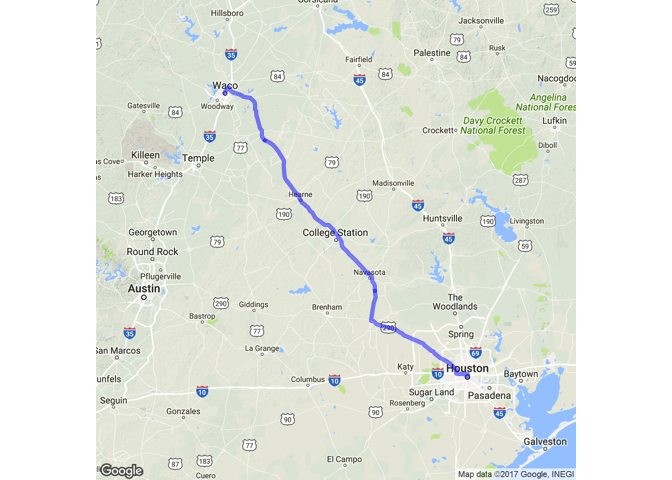

(They also provide information on how long it takes to get from point A to point B.)

Map distances, in both length and anticipated time, can be computed with `mapdist()`). Moreover the function is vectorized:

``` r
mapdist(c("houston, texas", "dallas"), "waco, texas")
#  Source : https://maps.googleapis.com/maps/api/distancematrix/json?origins=dallas&destinations=waco%2C%20texas&mode=driving&language=en-EN
#  Source : https://maps.googleapis.com/maps/api/distancematrix/json?origins=houston%2C%20texas&destinations=waco%2C%20texas&mode=driving&language=en-EN
#              from          to      m      km     miles seconds   minutes
#  1 houston, texas waco, texas 298587 298.587 185.54196   10314 171.90000
#  2         dallas waco, texas 152823 152.823  94.96421    5329  88.81667
#       hours
#  1 2.865000
#  2 1.480278
```

### Google credentialing

If you have a Google API key, you can exceed the standard limits Google places on queries. By default, when **ggmap** is loaded it will set the following credentials and limits:

``` r
ggmap_credentials()
#  Google - 
#     key :  
#     account_type : standard 
#     day_limit : 2500 
#     second_limit : 50 
#     client :  
#     signature :
```

Look at the documentation of `?register_google()` to learn more. If you do have an API key, you set it with:

``` r
register_google(key = "[your key here]", account_type = "premium", day_limit = 100000)
ggmap_credentials()
#  Google - 
#     key : [your key here] 
#     account_type : premium 
#     day_limit : 1e+05 
#     second_limit : 50 
#     client :  
#     signature :
```

These will then be used and checked when creating the query URL:

``` r
register_google(key = "AbCdEfGhIjKlMnOpQrStUvWxYz")
get_googlemap("waco texas", urlonly = TRUE)
#  [1] "https://maps.googleapis.com/maps/api/staticmap?center=waco+texas&zoom=10&size=640x640&scale=2&maptype=terrain&key=AbCdEfGhIjKlMnOpQrStUvWxYz"
```

For anything that hasn't been implemente (URL-wise), you can inject code into the query usin g `inject`:

``` r
get_googlemap("waco texas", urlonly = TRUE, inject = "otherItem = Stuff")
#  [1] "https://maps.googleapis.com/maps/api/staticmap?center=waco+texas&zoom=10&size=640x640&scale=2&maptype=terrain&key=AbCdEfGhIjKlMnOpQrStUvWxYz&otherItem%20=%20Stuff"
```

Installation
------------

-   From CRAN: `install.packages("ggmap")`

-   From Github: `devtools::install_github("dkahle/ggmap")`
# ggmap
